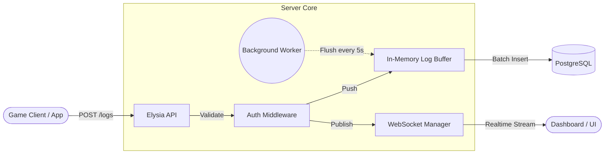

# Logs API 🚀


**API de Ingestão e Consulta de Logs Estruturados de Alta Performance.**

Projetada para resolver o problema de observabilidade em **Jogos Distribuídos (Roblox/Unity)** e **Microsserviços**, onde a centralização de logs em tempo real é crítica para debugging, auditoria e telemetria.

---

## 🏗️ Arquitetura e Performance

A solução utiliza um design focado em **baixa latência de escrita** (Write-Heavy) e **isolamento multi-tenant**.

### Destaques Técnicos
- **In-Memory Log Buffer:** Agrupamento de inserções em lotes (Batch Processing) para evitar gargalos no PostgreSQL.
- **Realtime WebSockets:** Streaming de logs instantâneo para dashboards conectados.
- **Fire-and-Forget:** Resposta imediata ao cliente enquanto a persistência ocorre em background.
- **Multi-Tenant:** Isolamento rigoroso de dados por `UniverseId` (Tenant) via API Keys.

### Fluxo de Dados


---

## 📚 Documentação Detalhada

Para guias completos, consulte os arquivos na pasta `/docs`:

- 🌐 **[Guia de Rotas HTTP](./docs/rotas.md)**: Referência de todos os endpoints REST, parâmetros e autenticação.
- 🔌 **[WebSocket Realtime](./docs/websocket.md)**: Como se conectar e interagir via socket para streaming em tempo real.
- 🚀 **[Guia de Deployment](./docs/deploy.md)**: Instruções para Docker, Discloud, migrações de banco e CI/CD.
- 📖 **Swagger UI**: Disponível em `/docs` com a aplicação rodando.

---

## 🛠️ Stack Tecnológica

| Componente | Tecnologia | Motivação |
|------------|------------|-----------|
| **Runtime** | [Bun](https://bun.sh) | Performance superior e ferramentas integradas. |
| **Framework** | [ElysiaJS](https://elysiajs.com) | Otimizado para Bun, com suporte nativo a WebSockets e Swagger. |
| **Database** | PostgreSQL | Armazenamento robusto com suporte a JSONB. |
| **ORM** | [Drizzle](https://orm.drizzle.team) | Type-safe, leve e focado em performance. |
| **Logger** | Custom Structured | Logs JSON em produção e formatados em desenvolvimento. |

---

## ⚡ Início Rápido

### Pré-requisitos
- **Bun** instalado (`curl -fsSL https://bun.sh/install | bash`)
- Instância do **PostgreSQL** ativa

### Instalação e Execução
1. **Clone o repositório:**
   ```bash
   git clone https://github.com/iamthebestts/logs-api
   cd logs-api
   ```
2. **Instale as dependências:**
   ```bash
   bun install
   ```
3. **Configure as variáveis de ambiente:**
   ```bash
   cp .env.example .env
   # Preencha DATABASE_URL e MASTER_KEY no .env
   ```
4. **Inicie o servidor:**
   ```bash
   bun run dev   # Modo desenvolvimento
   bun run start # Modo produção
   ```

---

## 🧪 Qualidade e Testes

O projeto segue rigorosos padrões de qualidade com testes automatizados cobrindo autenticação, lógica de buffer, rotas e websockets.

```bash
bun test              # Rodar suíte de testes
bun run test:coverage # Relatório de cobertura
```

---

## 🔒 Segurança

- **Rate Limiting:** Proteção contra força bruta e spam de logs.
- **Helmet Headers:** Implementação de headers de segurança OWASP.
- **Graceful Shutdown:** Garante a integridade dos dados no buffer antes do desligamento.
