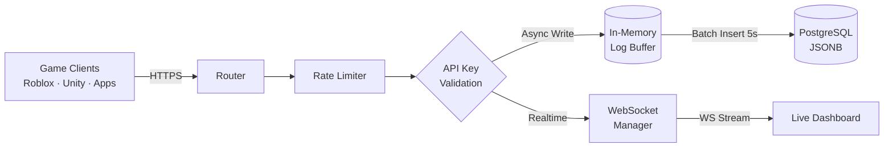

# UniverseLogs API 🚀

[](https://github.com/iamthebestts/UniverseLogs/actions/workflows/pipeline.yml)


**API de Ingestão e Consulta de Logs Estruturados de Alta Performance.**

Projetada para resolver o problema de observabilidade em **Jogos Distribuídos (Roblox/Unity)** e **Microsserviços**, onde a centralização de logs em tempo real é crítica para debugging, auditoria e telemetria.

---

## 🏗️ Arquitetura e Performance

A solução utiliza um design focado em **baixa latência de escrita** (Write-Heavy) e **isolamento multi-tenant**.



### Destaques Técnicos
- **In-Memory Log Buffer:** Agrupamento de inserções em lotes (Batch Processing) para evitar gargalos no PostgreSQL.
- **Realtime WebSockets:** Streaming de logs instantâneo para dashboards conectados.
- **Multi-Tenant Nativo:** Isolamento rigoroso de dados por `UniverseId` (Tenant) via hashes de API Keys.
- **Segurança Pronta:** Rate limiting granular, security headers (OWASP) e Graceful Shutdown.
- **Logger Estruturado:** Geração de logs JSON em produção para fácil integração com Datadog/ELK.

### Métricas e Performance
- **Escrita (POST /api/logs):** Latência alvo &lt; 10 ms (p95) em ambiente típico; inserções são bufferizadas e persistidas em batch a cada 5 s.
- **Leitura (GET /api/logs/:id, consultas):** Índices em `universe_id` e `timestamp`; consultas sempre filtradas por tenant.
- **WebSocket:** Baixa latência de broadcast; suporta PING/PONG e comandos (QUERY_LOGS, SEND_LOG) no mesmo canal.
- **Benchmarks:** Execute `BENCHMARK_API_KEY=sua-chave bun run benchmark` (requer servidor rodando) para um teste de carga simples. Resultados de referência em [docs/operations.md](./docs/operations.md#métricas-e-benchmarks).

---

## ⚡ Início Rápido (Local)

### 1. Preparação
- **Bun** instalado (`curl -fsSL https://bun.sh/install | bash`)
- Instância do **PostgreSQL** ativa

### 2. Instalação e Configuração
```bash
git clone https://github.com/iamthebestts/UniverseLogs
cd UniverseLogs
bun install
cp .env.example .env
```
> Edite o `.env` e configure sua `DATABASE_URL` e `MASTER_KEY`.

### 3. Execução
```bash
bun run dev   # Modo desenvolvimento (com logs coloridos)
bun run start # Modo produção (performance máxima)
```

---

## 🛠️ Primeiros Passos (Operacional)

Após subir a API, você precisa criar sua primeira chave de acesso:

1. **Crie uma API Key via Rota Interna:**
   ```bash
   curl -X POST http://localhost:3000/internal/keys/register \
     -H "Content-Type: application/json" \
     -H "x-master-key: SUA_MASTER_KEY_AQUI" \
     -d '{"universeId": "123456"}'
   ```
2. **Use a chave retornada para enviar logs:**
   ```bash
   curl -X POST http://localhost:3000/api/logs \
     -H "x-api-key: CHAVE_RETORNADA" \
     -d '{"level": "info", "message": "API operacional!"}'
   ```

---

## 💻 Exemplo de Cliente (Node/Bun)

Snippet mínimo para enviar logs e ler um log por ID usando a API:

```typescript
const API_BASE = "http://localhost:3000";
const API_KEY = "sua-chave-aqui";

// Enviar um log
async function sendLog(level: string, message: string, metadata?: Record<string, unknown>) {
  const res = await fetch(`${API_BASE}/api/logs`, {
    method: "POST",
    headers: {
      "Content-Type": "application/json",
      "x-api-key": API_KEY,
    },
    body: JSON.stringify({ level, message, ...(metadata && { metadata }) }),
  });
  if (!res.ok) throw new Error(await res.text());
  return res.json();
}

// Buscar um log por ID
async function getLog(id: string) {
  const res = await fetch(`${API_BASE}/api/logs/${id}`, {
    headers: { "x-api-key": API_KEY },
  });
  if (!res.ok) throw new Error(await res.text());
  return res.json();
}

// Uso
const log = await sendLog("info", "Evento do jogo", { place_id: "123", user_id: "456" });
console.log("Log criado:", log.id);
const same = await getLog(log.id);
console.log("Log lido:", same);
```

Para **streaming em tempo real**, use o WebSocket documentado em [docs/websocket.md](./docs/websocket.md).

---

## 🧪 Qualidade e Testes

O projeto possui uma suíte de testes robusta que garante a integridade dos fluxos críticos.

- **Testes Unitários/Integração:** Validação de lógica com mocks.
- **Testes E2E (End-to-End):** Validação real com banco de dados, testando autenticação, buffer e limites de taxa.

```bash
bun test              # Roda testes unitários
bun run test:e2e      # Roda testes E2E (Requer banco 'logs_test')
bun run test:coverage # Relatório de cobertura
```

---

## 📖 Documentação da API (Swagger)

Com o servidor rodando, a documentação interativa está disponível em:

- **Swagger UI:** [http://localhost:3000/docs](http://localhost:3000/docs) (ou `https://<seu-dominio>/docs` em produção)

Lá você pode explorar todos os endpoints, autenticar com `X-API-Key` / `X-Master-Key` e testar as requisições diretamente no navegador.

---

## 📚 Documentação Complementar

- 🌐 **[Guia de Rotas REST](./docs/rotas.md)**
- 🔌 **[WebSocket Realtime](./docs/websocket.md)** — streaming de logs em tempo real
- 🚀 **[Guia de Deployment](./docs/deploy.md)**

---

## 📄 Licença

Distribuído sob a licença MIT. Veja `LICENSE` para mais informações.

---
Desenvolvido por [iamthebestts](https://github.com/iamthebestts) 🚀

---

<div align="center">
  
  <h3>🚀 Precisa de uma API ou Bot Personalizado?</h3>
  <p>A <strong>Nexo+</strong> vai além do Roblox! Se você precisa de uma API específica, integração de sistemas ou um bot dedicado para automatizar seus processos, nós desenvolvemos a solução ideal para você.</p>
  <p>Unimos criatividade e eficiência para oferecer serviços completos no <strong>Roblox Studio</strong> (builds e scripts) e desenvolvimento especializado de <strong>APIs e Bots</strong> sob medida.</p>
  <p><strong>Transforme sua ideia em realidade agora:</strong><br/>
  👉 <a href="https://discord.gg/EPucmXpDQR">https://discord.gg/EPucmXpDQR</a></p>
</div>
