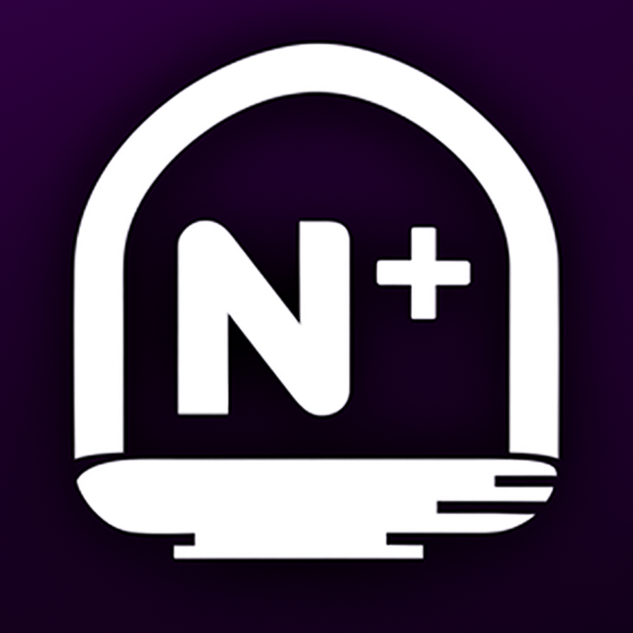

# UniverseLogs: Fundação Escalável de Observabilidade

[](https://github.com/iamthebestts/UniverseLogs/actions/workflows/pipeline.yml)


O **UniverseLogs** é um projeto open-source que serve como uma **fundação robusta e escalável** para sistemas de observabilidade multi-tenant. Focado em ambientes distribuídos e jogos (como Roblox e Unity), ele demonstra padrões arquiteturais para lidar com alto volume de ingestão de logs e streaming em tempo real.

Este projeto foi construído para demonstrar experiência na criação de APIs escaláveis, performáticas e resilientes. **É uma base sólida:** quem quiser pode fazer um fork, escalar, adicionar mais camadas de segurança (como criptografia no banco de dados) e transformá-lo no seu próprio produto!

---

## 🎯 Proposta e Objetivos

Diferente de sistemas excessivamente complexos, o UniverseLogs foca no que importa para não gargalar sua aplicação principal: ingestão rápida e desacoplamento. 

- **Arquitetura Desacoplada:** Um motor de ingestão em lote (batching) protege o banco de dados contra picos massivos de requisições.
- **Isolamento de Tenants:** Desenvolvido nativamente para servir múltiplos projetos ("Universes") com chaves de API com hash e separação clara de dados.
- **Sinergia em Tempo Real:** Transmissão de logs no exato momento em que chegam através de WebSockets.
- **Evolução Aberta:** Uma base de código limpa em TypeScript (com Bun + Elysia), pronta para receber features de billing, retenção dinâmica, criptografia de ponta a ponta, etc.

## 🎮 O que dá pra construir com essa base?

- Painéis de acompanhamento de gameplay em tempo real.
- Sistemas de auditoria de ações administrativas em jogos/sistemas.
- Centralização de telemetria e análise de economia virtual.
- Agregadores de erros e crashes distribuídos.

---

## 🏗️ Como a Arquitetura Funciona

A arquitetura resolve o principal problema de APIs de log: a sobrecarga do banco de dados (IOPS). Para isso, a escrita principal é separada da persistência através de um buffer em memória.

1. **Gateway (Recepção):** Valida a API Key, aplica Rate Limit e aceita a requisição.
2. **Buffer Engine (Memória):** Coloca o log em uma fila de processamento rápido. A API já responde `200 OK` para o usuário não ficar esperando.
3. **Distribuição e Persistência:** A cada *X* segundos (ou tamanho de fila), os logs são salvos em lote (batch) no PostgreSQL e disparados simultaneamente para todos os clientes conectados via WebSocket.

```mermaid
flowchart LR

  %% CLIENT
  C[Clientes Distribuídos<br/>Roblox · Unity · Microsserviços]

  %% GATEWAY
  R[Roteador de Alta Performance]
  RL[Rate Limit]
  AUTH{Validação de<br/>API Key}

  %% ENGINE
  LB[(Buffer de Logs<br/>em Memória)]
  WS[Transmissor<br/>WebSocket]

  %% STORAGE
  DB[(PostgreSQL<br/>JSONB)]

  %% DASHBOARD
  DASH[Dashboard / Consumidores]

  %% FLOW
  C -->|POST /logs| R
  R --> RL --> AUTH
  AUTH -->|Devolve 200 OK| LB
  AUTH -->|Transmissão Ao Vivo| WS
  LB -->|Persitência em Lote (Batch)| DB
  WS -->|Stream em Tempo Real| DASH
```

### Detalhes Técnicos

- **Batching Integrado:** Evita conexões e inserções desnecessárias no banco de dados agrupando operações.
- **Performance Orientada:** Uso de tecnologias de ponta como `Bun`, `ElysiaJS` e `PostgreSQL` puro via protocolo eficiente.
- **Logs Estruturados:** A coluna `metadata` usa `JSONB`, permitindo que os desenvolvedores injetem objetos complexos e depois filtrem ou exportem isso facilmente de acordo com a regra de negócio do seu projeto.

---

## 🚀 Como Rodar Localmente

Se você deseja testar a arquitetura, contribuir ou criar seu próprio fork:

### Pré-requisitos
- **Bun** (versão 1.x+)
- **PostgreSQL 15+**

### Configurando
```bash
git clone https://github.com/iamthebestts/UniverseLogs
cd UniverseLogs
bun install
cp .env.example .env
```
> Configure a sua `DATABASE_URL` e uma `MASTER_KEY` super secreta no seu `.env`.

### Rodando
```bash
bun run dev   # Modo de desenvolvimento (logs formatados no console)
bun run start # Modo de produção (performance em primeiro lugar)
```

---

## 📖 Testando a API

1. **Crie um Universo e pegue a Chave (Ação de Admin):**
   ```bash
   curl -X POST http://localhost:3000/internal/keys/register \
     -H "Content-Type: application/json" \
     -H "x-master-key: SUA_MASTER_KEY_DO_ENV" \
     -d '{"universeId": "123456"}'
   ```
2. **Faça o "Jogo" enviar um Log:**
   ```bash
   curl -X POST http://localhost:3000/api/logs \
     -H "x-api-key: SUA_CHAVE_GERADA_AQUI" \
     -d '{"level": "info", "message": "Carro explodiu no mapa", "metadata": {"x": 10, "y": 20}}'
   ```

---

## 🗺️ O que pode ser adicionado (Ideias para Fork)

Como dito, esta é uma fundação excelente. Alguns caminhos naturais de evolução para quem deseja escalar ainda mais essa base:

- [ ] Criptografia de banco de dados (At-Rest Encryption) para dados sensíveis ou PII.
- [ ] Implementação de filas externas (como Kafka, Redis Streams ou RabbitMQ) caso precise distribuir os "workers" em vários containers.
- [ ] Rotinas (CRON jobs) automáticas para limpeza de logs antigos (Retention policies).
- [ ] Sistema de Billing (Stripe) para comercializar infraestrutura SaaS.

---

## 📚 Documentações Técnicas

- 🌐 **[Referência da API REST](./docs/rotas.md)**
- 🔌 **[Documentação do WebSocket](./docs/websocket.md)**
- 🚀 **[Guia de Deploy (Docker/Discloud)](./docs/deploy.md)**
- 📖 **Swagger/OpenAPI:** Disponível acessando `/docs` no navegador quando estiver rodando no modo `dev`.

---

## 🧪 Qualidade do Código

A base conta com testes unitários, de integração (E2E) com banco de dados em memória e rate limiting simulado, para que qualquer modificação continue provando a resiliência do sistema.

```bash
bun run test:e2e      # Fluxos de Integração Reais
bun run test:coverage # Relatório de Testes
```

---

## 📄 Licença

Distribuído sob a Licença MIT. Sinta-se livre para copiar, modificar, fechar código ou usar comercialmente. (Veja o arquivo `LICENSE` para mais informações).

---

Feito com 💡 por **[iamthebestts](https://github.com/iamthebestts)**. Serve como uma demonstração da minha experiência em construir serviços modernos de ponta a ponta.

<div align="center">
  
  <h3>Construindo APIs e Bots de Sucesso</h3>
  <p>Na <strong>Nexo+</strong>, levamos soluções para fora dos limites convencionais! Desenvolvemos APIs de back-end dedicadas, integração de sistemas robustos e bots sob medida para automatizar e conectar seu ecossistema ao seu público.</p>
  <p><a href="https://discord.gg/EPucmXpDQR">Fale conosco no Discord da Nexo+</a></p>
</div>
