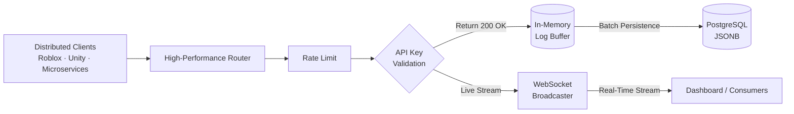

# UniverseLogs: Scalable Observability Foundation

[](https://github.com/iamthebestts/UniverseLogs/actions/workflows/pipeline.yml)


**UniverseLogs** is an open-source project that serves as a **robust, scalable foundation** for multi-tenant observability systems. Focused on distributed environments and games (such as Roblox and Unity), it demonstrates architectural patterns for handling high-volume log ingestion and real-time streaming.

This project was built to showcase experience in creating scalable, performant, and resilient APIs. **It is a solid base:** anyone can fork it, scale it, add more security layers (e.g. database encryption), and turn it into their own product!

> ⚠️ **IMPORTANT**: This module must be used **exclusively on the server**. Read the [Security Policy](SECURITY.md) before using in production.

---

## 🎯 Purpose and Goals

Unlike overly complex systems, UniverseLogs focuses on what matters so it doesn’t bottleneck your main application: fast ingestion and decoupling.

- **Decoupled Architecture:** A batch ingestion engine protects the database from massive request spikes.
- **Tenant Isolation:** Built to serve multiple projects (“Universes”) with hashed API keys and clear data separation.
- **Real-Time Streaming:** Logs are streamed the moment they arrive via WebSockets.
- **Open Evolution:** A clean TypeScript codebase (Bun + Elysia) ready for billing, dynamic retention, end-to-end encryption, and more.

## 🎮 What You Can Build With This Base

- Real-time gameplay monitoring dashboards.
- Audit systems for administrative actions in games/systems.
- Centralized telemetry and virtual economy analysis.
- Aggregators for distributed errors and crashes.

---

## 🏗️ How the Architecture Works

The architecture addresses the main problem of log APIs: database overload (IOPS). Main writes are separated from persistence via an in-memory buffer.

1. **Gateway (Reception):** Validates the API Key, applies rate limiting, and accepts the request.
2. **Buffer Engine (Memory):** Puts the log in a fast processing queue. The API responds `200 OK` so the client doesn’t wait.
3. **Distribution and Persistence:** Every *X* seconds (or queue size), logs are batch-written to PostgreSQL and broadcast to all clients connected via WebSocket.



### Technical Details

- **Built-in Batching:** Reduces unnecessary database connections and inserts by grouping operations.
- **Performance-First:** Uses technologies like `Bun`, `ElysiaJS`, and plain `PostgreSQL` over an efficient protocol.
- **Structured Logs:** The `metadata` column uses `JSONB`, so you can store complex objects and filter or export them easily for your project’s needs.

---

## 🚀 Running Locally

To try the architecture, contribute, or create your own fork:

### Prerequisites
- **Bun** (1.x+)
- **PostgreSQL 15+**

### Setup
```bash
git clone https://github.com/iamthebestts/UniverseLogs
cd UniverseLogs
bun install
cp .env.example .env
```
> Set your `DATABASE_URL` and a secret `MASTER_KEY` in `.env`.

### Run
```bash
bun run dev   # Development (formatted logs in console)
bun run start # Production (performance first)
```

---

## 📖 Testing the API

1. **Create a Universe and get the key (admin action):**
   ```bash
   curl -X POST http://localhost:3000/internal/keys/register \
     -H "Content-Type: application/json" \
     -H "x-master-key: YOUR_MASTER_KEY_FROM_ENV" \
     -d '{"universeId": "123456"}'
   ```
2. **Send a log from your “game”:**
   ```bash
   curl -X POST http://localhost:3000/api/logs \
     -H "x-api-key: YOUR_GENERATED_KEY_HERE" \
     -d '{"level": "info", "message": "Car exploded on map", "metadata": {"x": 10, "y": 20}}'
   ```

---

## 📦 Official SDKs and Clients

This project provides official SDKs to integrate with different platforms and languages. Currently available:

### 🎮 Roblox (Luau)

A full, resilient client for Roblox games.

- **Location:** [`/sdk/roblox/`](./sdk/roblox/)
- **Documentation:** [📖 Roblox Client Guide](./sdk/roblox/docs.md)
- **Features:**
  - ⚡ In-memory buffer with batch sending (batching)
  - 🛡️ Automatic DataStore fallback on failure
  - 🚫 Built-in anti-spam (throttling)
  - 🔍 Automatic sanitization of Roblox types (Vector3, CFrame, etc.)
  - 📊 Optional automatic error capture

**Quick setup:**
```lua
local ServerStorage = game:GetService("ServerStorage")
local UniverseLogs = require(ServerStorage.UniverseLogs)

local ul = UniverseLogs.new("your-api-key", {
    baseUrl = "https://your-api.com"
})

ul:init()
ul:info("Server started!", { topic = "boot" })
```

### 🔮 Planned Languages

Over time we plan to add official SDKs for:

- 🐍 **Python** — Backends, automation scripts, data science
- 🟨 **JavaScript/TypeScript** — Node.js, Deno, Bun
- 🦀 **Rust** — High-performance applications
- ☕ **Java** — Minecraft servers (Spigot/Paper) and enterprise apps

**Contributions welcome!** If you build a client for another language, open a PR to add it under `/sdk/`.

---

## 🗺️ Possible Additions (Fork Ideas)

As mentioned, this is a strong foundation. Natural next steps for scaling it further:

- [ ] Database encryption (at-rest) for sensitive or PII data.
- [ ] External queues (e.g. Kafka, Redis Streams, RabbitMQ) to distribute workers across containers.
- [ ] Automated retention (CRON) for cleaning old logs.
- [ ] Billing (e.g. Stripe) for SaaS infrastructure.

---

## 📚 Technical Documentation

- 🌐 **[REST API Reference](./docs/routes.md)**
- 🔌 **[WebSocket Documentation](./docs/websocket.md)**
- 🚀 **[Deploy Guide (Docker/Discloud)](./docs/deploy.md)**
- 📖 **Swagger/OpenAPI:** Available at `/docs` in the browser when running in `dev` mode.

**Documentação em português (pt-BR):** [README](pt-br/README.md) · [Índice da documentação técnica](docs/pt-br/README.md)

---

## 🧪 Code Quality

The project includes unit tests and integration (E2E) tests with an in-memory database and simulated rate limiting.

```bash
bun run test          # Unit tests
bun run test:coverage # Unit tests with coverage report
bun run test:e2e      # E2E integration flows (see Test environment below)
```

### Test environment

- **Unit tests** (`test`, `test:coverage`): run in any environment; no `NODE_ENV` requirement.
- **E2E tests** (`test:e2e`): use `NODE_ENV=test` and load `.env.test`. The script is written for Unix-like shells (e.g. Linux, macOS, WSL). On **Windows (PowerShell/CMD)** the `NODE_ENV=test` prefix does not work as-is — run E2E in **WSL**, **Git Bash**, or **CI** (Linux). Alternatively set `NODE_ENV=test` in your shell before running `bun run test:e2e`, or use a cross-platform env helper (e.g. `cross-env`) if you add it to the project.

---

## 🔒 Security and Responsibility

This project handles sensitive database read/write operations. Before using in production, **read our [Security Policy](SECURITY.md)**.

**Main points:**
- ✅ Use only in `ServerScriptService` or `ServerStorage`
- ❌ Never expose API keys to the client
- ⚖️ You are responsible for legal compliance (LGPD, GDPR, COPPA)
- 💰 Monitor storage and traffic costs

**[📖 Read the full policy →](SECURITY.md)**

---

## 📄 License

Distributed under the MIT License. You may copy, modify, close the source, or use it commercially. (See the `LICENSE` file for details.)
